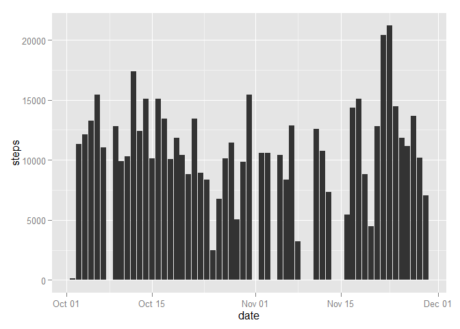
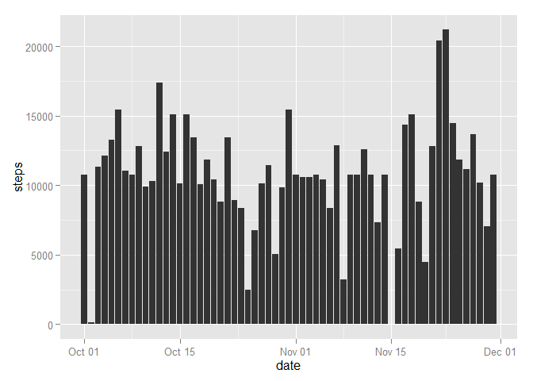

# Reproducible Research: Peer Assessment 1

## Initial steps


```r
# sets the locale to English to ensure reproductible results regardless of the configured  locale of the computer
Sys.setlocale("LC_TIME", "English")
```

```
## [1] "English_United States.1252"
```

## Loading and preprocessing the data


```r
# unzip activity.zip if activity.csv is not found
if (!file.exists('activity.csv')) {
    unzip('activity.zip')
}
#read activity.csv
activity <- read.csv('activity.csv')
# parse the date column
activity$date <- as.Date(activity$date, "%Y-%m-%d")
```

## What is mean total number of steps taken per day?

### 1. Make a histogram of the total number of steps taken each day


```r
library("ggplot2")
steps_by_day <- aggregate(steps ~ date,data = activity, sum, na.rm = TRUE)
ggplot(steps_by_day, aes(x = date, y = steps)) + geom_bar(stat = "identity")
```

 

### 2. Calculate and report the mean and median total number of steps taken per day


```r
steps_by_day.mean <- mean(steps_by_day$steps)
steps_by_day.median <- median(steps_by_day$steps)
```

The mean of the number of steps per day is **10766.19**.  
The median of the number of steps per day is **10765**.

## What is the average daily activity pattern?

### 1. Make a time series plot (i.e. type = "l") of the 5-minute interval (x-axis) and the average number of steps taken, averaged across all days (y-axis)


```r
library(ggplot2)
average_steps_by_interval <- aggregate(steps ~ interval,data = activity, mean, na.rm = TRUE)
ggplot(average_steps_by_interval, aes(x = interval, y = steps)) + geom_line()
```

 

### 2. Which 5-minute interval, on average across all the days in the dataset, contains the maximum number of steps?


```r
# get the row from average_steps_by_interval with the max steps value
max_average_interval <- average_steps_by_interval[which.max(average_steps_by_interval$steps),]
max_average_interval_value <- max_average_interval$interval
max_average_interval_steps <- max_average_interval$steps
```

The 5-minute interval that on average across all the days in the dataset contains the maximum number of steps is interval **835** with **206.1698113** steps on average.

## Imputing missing values

### 1. Calculate and report the total number of missing values in the dataset (i.e. the total number of rows with NAs)

```r
na_count <- nrow(activity[is.na(activity$steps),])
```

There are **2304** missing steps value.

### 2. Devise a strategy for filling in all of the missing values in the dataset. The strategy does not need to be sophisticated. For example, you could use the mean/median for that day, or the mean for that 5-minute interval, etc.

The mean for the 5-minute interval will be used. For this the computeSteps function will be defined. It will take two parameters *steps* and *interval*.  
It will returns the average number of steps from *average_steps_by_interval* for *interval* if *steps* is NA or the original *steps* value otherwise.


```r
computeSteps <- function(steps, interval) {
    if (is.na(steps))
        # returns the average number of step for the passed interval
        return (average_steps_by_interval[average_steps_by_interval$interval == interval,]$steps)
    else
        # we keep the value as is
        return (steps)
}
```

### 3. Create a new dataset that is equal to the original dataset but with the missing data filled in.


```r
activity_with_missing_values <- activity
# apply computeSteps to each steps value
activity_with_missing_values$steps <- mapply(computeSteps, activity$steps, activity$interval)
```

### 4. Make a histogram of the total number of steps taken each day and Calculate and report the mean and median total number of steps taken per day. Do these values differ from the estimates from the first part of the assignment? What is the impact of imputing missing data on the estimates of the total daily number of steps?


```r
# draw the plot
library(ggplot2)
steps_by_day_with_missing_values <- aggregate(steps ~ date,data = activity_with_missing_values, sum, na.rm = TRUE)
ggplot(steps_by_day_with_missing_values, aes(x = date, y = steps)) + geom_bar(stat = "identity")
```

 

```r
# compute mean and median
steps_by_day_with_missing_values.mean <- mean(steps_by_day_with_missing_values$steps)
steps_by_day_with_missing_values.median <- median(steps_by_day_with_missing_values$steps)

# compute variation percentage
mean_change <- (steps_by_day_with_missing_values.mean - steps_by_day.mean)/steps_by_day.mean*100
median_change <- (steps_by_day_with_missing_values.median - steps_by_day.median)/steps_by_day.median*100
```

Filling the missing data with the chosen strategy has a 
**0%** 
change effect on the mean.  

Filling the missing data with the chosen strategy has a 
**0.0110421%** 
change effect on the median.

## Are there differences in activity patterns between weekdays and weekends?

### 1. Create a new factor variable in the dataset with two levels – “weekday” and “weekend” indicating whether a given date is a weekday or weekend day.


```r
# dayType
# param date : a date
# returns weekend if date is on a Saturday or Sunday, weekday otherwise
dayType <- function(date) {    
    if (weekdays(date) %in% c("Saturday", "Sunday"))
        return (as.factor("weekend"))
    else
        return (as.factor("weekday"))    
}

activity_with_day_type <- activity_with_missing_values
# Apply dayType to each date value
activity_with_day_type$daytype <- sapply(activity_with_missing_values$date, FUN=dayType)
```

### 2. Make a panel plot containing a time series plot (i.e. type = "l") of the 5-minute interval (x-axis) and the average number of steps taken, averaged across all weekday days or weekend days (y-axis). See the README file in the GitHub repository to see an example of what this plot should look like using simulated data.


```r
library(ggplot2)
steps_by_day_with_day_type <- aggregate(steps ~ interval + daytype, data=activity_with_day_type, mean)
ggplot(steps_by_day_with_day_type, aes(x = interval, y = steps)) + geom_line() + facet_grid(daytype ~ .)
```

 
